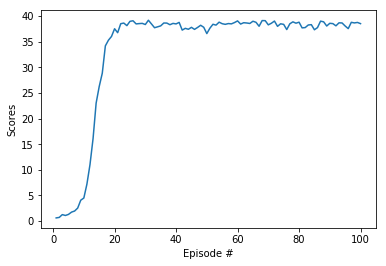

# Project 2: Continuous Control

Author: [Harald Wilbertz](http://github.com/wilbertz) 

The report contains three parts:

- **Design and Implementation**
- **Results**
- **Future Improvements** 

## Design and Implementation
The design and implementation is heavily influenced by the paper [Continuous control with deep
reinforcement learning](https://arxiv.org/abs/1509.02971). In particular the networks architectures 
for both actor and critic and specific values for most hyperparameters are based on this paper.

The paper describes an algorithms that uses a Deep Deterministic Policy Gradient (DDPG) agent. 

A model-free, off-policy actor-critic algorithm using deep function approximators 
that can learn policies in high-dimensional continuous action spaces, is used. Model-free policy 
based learning algorithms are algorithms in which the agent learns
directly from the un-processed observation spaces without domain knowledge.

The Learning algorithm uses the Actor-Critic model in which the Critic model learns the value
function like DQN and uses it to determine how the Actor’s policy should change. 

This is different compared with DQN that learn indirectly through Q-values tables. The  implemented 
algorithms learns from the observation spaces using policy gradients. 

Initial attempts to solve the problem had to deal with significant instabilities during the learning 
process. In order to mitigate unstable learning techniques like Gradient Clipping, 
Soft Target Update through twin local / target network and Replay Buffer were used.

The Actor brings the advantage of learning in continuous actions space
without the need for extra layer of optimization procedures required in a value based
function while the Critic supplies the Actor with knowledge of the performance.

A single DDPG agent with one Replay Buffer that has experiences 
collected from all 20 environment agents is used.

The algorithm uses two deep neural networks (actor-critic).
The Actor model is a neural network with 2 hidden layers with size of 400 and 300,
Tanh is used in the final layer that maps states to actions. Batch normalization is used
for mini batch training.
The Critic model is similar to Actor model except the final layer is a fully connected
layer that maps states and actions to Q-values.

The final layer weights and biases of both the actor and critic
were initialized from a uniform distribution [−3 × 10−3, 3 × 10−3] and [3 × 10−3, 3 × 10−3]. 
This was to ensure the initial outputs for the policy and value estimates were near zero. 

### Hyperparameters

  The code uses a lot of hyperparameters. The values a are given below

  | Hyperparameter                      | Value   |
  | ----------------------------------- | ------- |
  | Gamma (discount factor)             | 0.99    |
  | Tau                                 | 1e-3    |
  | Learning rate actor                 | 1e-3    |
  | Learning rate critic                | 1e-3    |
  | Batch size                          | 1024    |
  | Replay buffer size                  | 1000000 |

  
## Results
The environment was solved in 100 episodes. An averaged score of 31.06 was reached. 
The score was averaged over the agents and the last 100 episodes. Below is a plot with the scores:

## Ideas for improvement

- Priority Experienced Replay  
The algorithm could be improved by using Priority Experienced Replay where important experience will be sampled more often:
[A novel DDPG method with prioritized experience replay](https://www.semanticscholar.org/paper/A-novel-DDPG-method-with-prioritized-experience-Hou-Liu/027d002d205e49989d734603ff0c2f7cbfa6b6dd).
This technique can reduce the training time and improve the stability of the learning process.

- Hyperparameter  
Last not least, hyperparameter search should improve the performance too.

